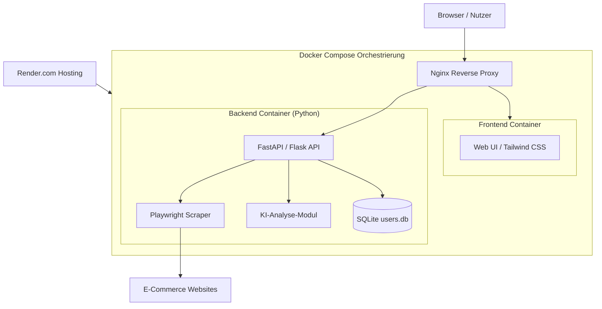

# Komponentendiagramm — DropchipAI

```mermaid
graph TB
    subgraph Docker-Compose ["Docker Compose Orchestrierung"]
        subgraph Frontend ["Frontend Container"]
            Web[Web UI / Tailwind CSS]
        end

        subgraph Backend ["Backend Container (Python)"]
            API[FastAPI / Flask API]
            Scraper[Playwright Scraper]
            AI[KI-Analyse-Modul]
            DB[(SQLite users.db)]
        end

        Nginx[Nginx Reverse Proxy]
    end

    User[Browser / Nutzer]
    ECommerce[E-Commerce Websites]
    Render[Render.com Hosting]

    User --> Nginx
    Nginx --> Frontend
    Nginx --> API
    API --> Scraper
    Scraper --> ECommerce
    API --> AI
    API --> DB
    Render --> Docker-Compose
```
