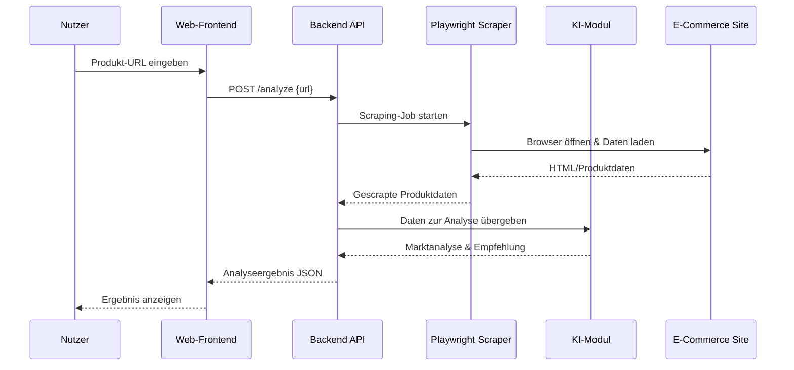

# Sequenzdiagramm — Scraping & KI-Analyse-Flow

```mermaid
sequenceDiagram
    participant U as Nutzer
    participant UI as Web-Frontend
    participant API as Backend API
    participant PW as Playwright Scraper
    participant AI as KI-Modul
    participant Web as E-Commerce Site

    U->>UI: Produkt-URL eingeben
    UI->>API: POST /analyze {url}
    API->>PW: Scraping-Job starten
    PW->>Web: Browser öffnen & Daten laden
    Web-->>PW: HTML/Produktdaten
    PW-->>API: Gescrapte Produktdaten
    API->>AI: Daten zur Analyse übergeben
    AI-->>API: Marktanalyse & Empfehlung
    API-->>UI: Analyseergebnis JSON
    UI-->>U: Ergebnis anzeigen
```
